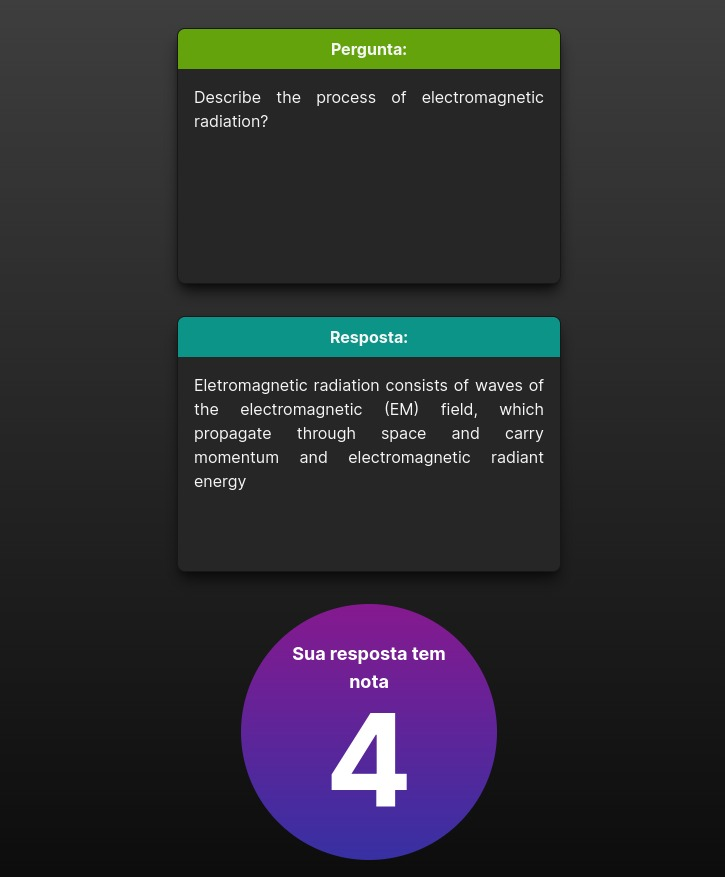

# Open Question Scorer
This project aimed to build a full automated open question scorer for short answers.

# Technology stack
## Back-end
- Python
- Django
- PostgreSQL
## Front-end
- JavaScript
- Next.js

# How to get up and running?
```
docker compose up -d --build
```

# Samples

